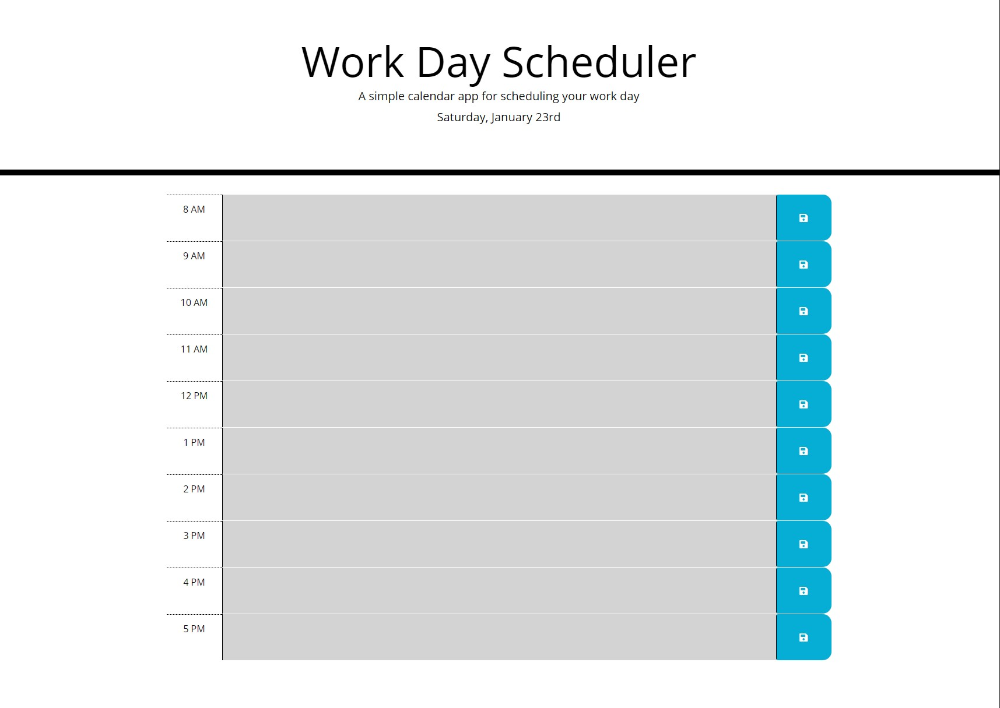
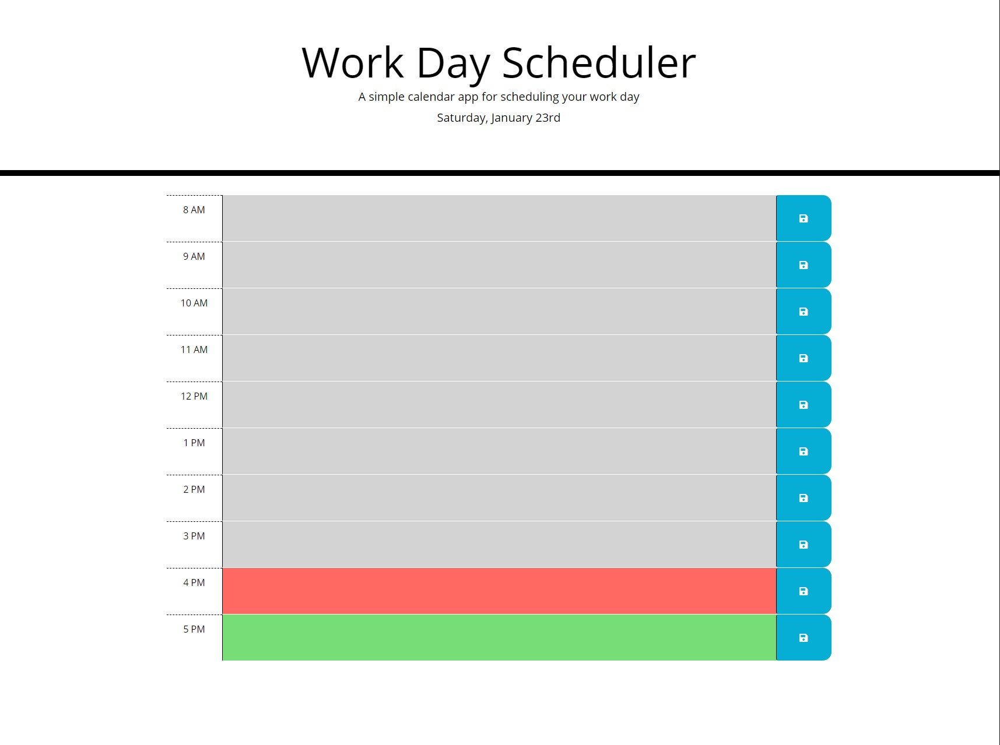

# Joseph Prospero's Workday Scheduler
Hello! This is my workday scheduler assignment for this week. I used HTML, CSS, and JavaScript in order to get things working. I also utilized online tools inlcuding Bootstrap and Moment throughout the code. The page allows you to input any events happening per hour of a common work day, beginning at 8:00 AM and ending at 5:00 PM. The top of the page tells you what day of the week and current date it currently is. The scheduler also keeps track of the time of day, utilizing color coding through JavaScript alongside CSS to indicate which events have happened in the past, current events happening in the present, and upcoming events in the future. 

## Screenshots

 
 

## Links to the Workday Scheduler
https://josephprospero.github.io/scheduler/

